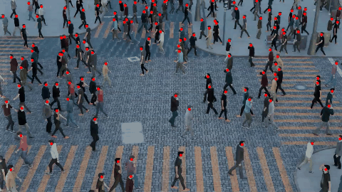

# Creating Synthetic Dataset Using Blender Addon

This repository contains the source files and tools for generating synthetic image and video datasets with ground-truth annotations using Blender and simulation extensions (such as JuPedSim).

---

## Goal

The main objective of this project is to create realistic, controllable synthetic computer vision datasets for pedestrian simulation, object detection, and tracking. The synthetic data generation is driven by Blender scene automation and python post-processing scripts.

---

## Source Files and Blender Setup

The dataset generation pipeline is built upon the following key files in this repository:

* **dataset_creation.blend**: Main Blender 3D scene file for rendering synthetic camera angles, lighting conditions, and ground-truth bounding box / point annotations.
* **dataset_creation_jupedesim.blend**: Extended Blender scene integrated with JuPedSim pedestrian trajectory simulation.
* **imgs_to_video.py**: Python processing script that compiles rendered image frames and pixel coordinate CSVs into clean and annotated (`_annotated.mp4`) videos.

---

## Collected Dataset

The current collected synthetic dataset is hosted on Google Drive -will ongoing collecting process-:

**[Download Collected Dataset on Google Drive](https://drive.google.com/drive/folders/1aQ3Nfu-lWY6WMvE6iy2iwKFKdKdyM09B?usp=sharing)**

---

## Annotated Video Example

Below is an annotated sample video generated by the pipeline, demonstrating synthetic pedestrian rendering along with ground-truth point annotations:



* **Direct Video Download**: [Watch / Download full MP4 Video](asset/sample_6_annotated.mp4)
* *Note: Media samples are stored in the tracked asset folder (`asset/sample_6_annotated.gif` and `asset/sample_6_annotated.mp4`).*

---

## Repository Structure

```text
.
├── asset/                            # Tracked media assets & annotated video examples
│   └── sample_6_annotated.mp4
├── dataset_creation.blend            # Main Blender 3D scene for dataset creation
├── dataset_creation_jupedesim.blend  # Blender scene with JuPedSim integration
├── imgs_to_video.py                  # Python script for video assembly & annotation overlay
├── blueprint.jpg                     # Reference layout / map blueprint
├── README.md                         # Project documentation
└── .gitignore                        # Git ignore rules (explicitly un-ignores asset/)
```

---

## Usage Instructions

### 1. Render Synthetic Frames in Blender
Open `dataset_creation.blend` or `dataset_creation_jupedesim.blend` in Blender, execute the simulation script, and render frames to `img_output/`. Blender will output:
* Image frames (`.jpg` / `.png`)
* Ground-truth pixel coordinates (`pixel_coords_all_frames.csv`)

### 2. Generate Annotated Videos
Run the Python video compilation script to generate clean and annotated videos:
```bash
python imgs_to_video.py
```
Outputs will be generated in `vid_output/` with corresponding ground-truth overlays.

---

## References and Links

* **Google Drive Dataset**: [Access Full Dataset Folder](https://drive.google.com/drive/folders/1aQ3Nfu-lWY6WMvE6iy2iwKFKdKdyM09B?usp=sharing)
* **GitHub Repository**: [creating-simulation-dataset-using-blender-addon](https://github.com/abdo20050/creating-simulation-dataset-using-blender-addon)
